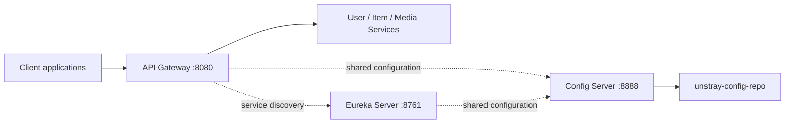

# Unstray Cloud Backend Platform

Central platform services for the Unstray Cloud microservices architecture. This repository contains the infrastructure services that allow application services such as User, Item, and Media Service to communicate through a single gateway, discover one another, and consume shared configuration.

## Student & Project Information

| Field          | Value            |
| -------------- | ---------------- |
| Student Name   | Kamesh Nethsara  |
| Student ID     | 241722037        |
| GCP Project ID | `unstray-506517` |

## Platform Components

| Module                  | Responsibility                                                         | Default URL             |
| ----------------------- | ---------------------------------------------------------------------- | ----------------------- |
| `unstray-config-server` | Serves centralized configuration from the configured Git repository    | `http://localhost:8888` |
| `unstray-eureka-server` | Netflix Eureka service registry for service registration and discovery | `http://localhost:8761` |
| `unstray-api-gateway`   | Reactive entry point for routing requests to backend services          | `http://localhost:8080` |

The gateway uses Spring Cloud Gateway and includes JWT utility/filter code, while Eureka provides the registry used by discoverable services. Service-specific configuration is maintained in [unstray-config-repo](unstray-config-repo/).



## Technology Stack

- Java 25
- Spring Boot 4.1.0
- Spring Cloud 2025.1.2
- Spring Cloud Gateway WebFlux
- Spring Cloud Config Server
- Netflix Eureka Server and Eureka Client
- Spring Boot Actuator for health and information endpoints
- JJWT 0.12.5 in the API Gateway for JWT-related processing
- Maven with Maven Wrapper scripts included in each service
- PM2 may be used by the deployment environment to supervise packaged Java processes; no PM2 configuration is committed in this repository

This platform layer does not directly use MySQL, PostgreSQL, or MongoDB. Database connections belong to the downstream application services and are configured outside these three modules.

## Prerequisites

- JDK 25
- Git
- Maven 3.8+ or the included Maven Wrapper
- Network access to the configured Config Server Git repository
- Downstream Unstray services, when testing gateway routes end to end

## Getting Started

Clone the repository and move to its root:

```bash
git clone <repository-url>
cd unstray-cloud-backend-platform
```

Build and test all modules from the root:

```powershell
.\mvnw.cmd clean verify
```

On macOS or Linux:

```bash
./mvnw clean verify
```

The root Maven project builds these modules:

```text
unstray-api-gateway/
unstray-config-server/
unstray-eureka-server/
```

## Local Configuration

The Config Server is configured to clone the remote repository below at startup:

```text
https://github.com/kameshNethsara/unstray-config-repo
```

Start the services in this order:

1. Config Server on port `8888`.
2. Eureka Server on port `8761`.
3. API Gateway on port `8080`.

The checked-in gateway configuration imports Config Server from `http://10.160.0.42:8888`. For a local-only setup, start the gateway with a localhost Config Server override:

```powershell
cd unstray-api-gateway
.\mvnw.cmd spring-boot:run "-Dspring-boot.run.arguments=--spring.config.import=optional:configserver:http://localhost:8888"
```

Alternatively, update `unstray-api-gateway/src/main/resources/application.yaml` for the local environment. The Eureka import is already optional, but it also references the same private Config Server address in the checked-in configuration.

## Running Individual Services

Run each command from the corresponding module directory.

```powershell
# Config Server
cd unstray-config-server
.\mvnw.cmd spring-boot:run

# Eureka Server
cd ..\unstray-eureka-server
.\mvnw.cmd spring-boot:run

# API Gateway
cd ..\unstray-api-gateway
.\mvnw.cmd spring-boot:run
```

To run packaged applications instead:

```powershell
java -jar unstray-config-server\target\config-server-0.0.1-SNAPSHOT.jar
java -jar unstray-eureka-server\target\eureka-server-0.0.1-SNAPSHOT.jar
java -jar unstray-api-gateway\target\api-gateway-0.0.1-SNAPSHOT.jar
```

When PM2 is part of the deployment pipeline, supervise each packaged JAR with an ecosystem file managed by the deployment environment. The repository currently provides the JARs and does not include an `ecosystem.config.js`.

## Health Checks

Actuator exposes health and info endpoints for each service:

```text
Config Server: http://localhost:8888/actuator/health
Eureka Server: http://localhost:8761/actuator/health
API Gateway:   http://localhost:8080/actuator/health
```

The Eureka dashboard is available at `http://localhost:8761/`. Config Server configuration can be queried with an endpoint such as:

```text
http://localhost:8888/item-service/default
```

## Project Structure

```text
.
├── pom.xml
├── unstray-api-gateway/
├── unstray-config-repo/
├── unstray-config-server/
└── unstray-eureka-server/
```

For module-specific details, see the README in each service directory. Deployment-specific GCP resources and secrets should be supplied through the deployment pipeline rather than committed to this repository.

## Testing

Run all module tests from the root:

```powershell
.\mvnw.cmd test
```

Run tests for one module:

```powershell
cd unstray-api-gateway
.\mvnw.cmd test
```

## License

No license has been specified in the Maven project yet.
